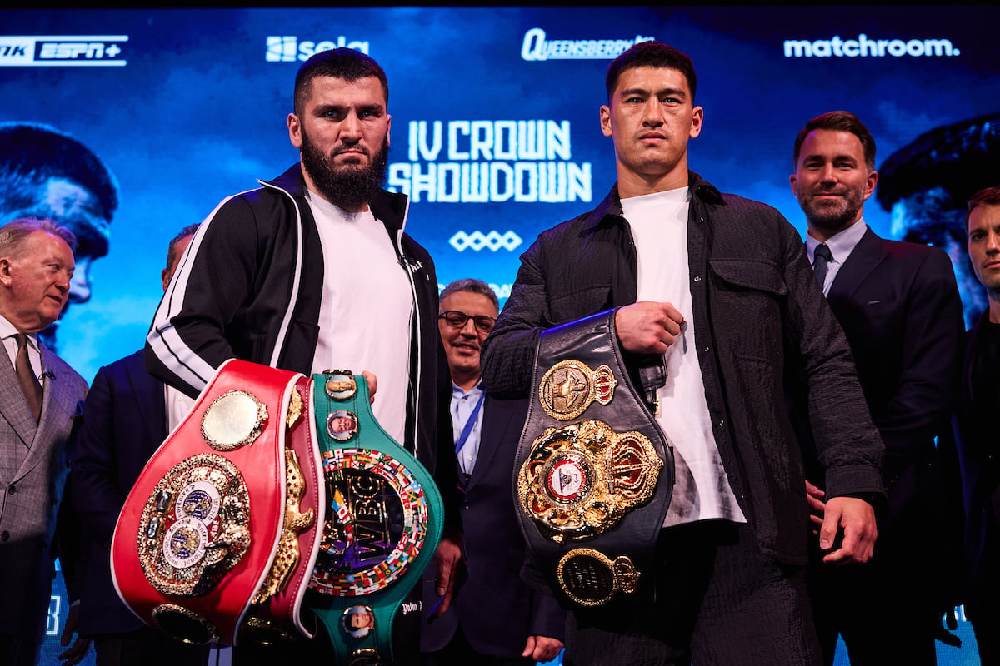

## Beterbiev Vs Bivol

Well it's been a few days since the showdown between the two top light heavyweights of our generation. Bivol vs Beterview, The Man vs The Beast. For undisputed, four belts. Three held by Beterview and one held by Bivol. 

After the fight I felt Bivol was the better technical boxer but Beterbiev was just a wild beast in there. The last two rounds really kind of showed what he was all about. He was walking this man down and I felt he would've eaten Bivol up if the fight went longer. 

Bivol was definitely schooling him in there but just the raw power and aggression... you can't deny it. 

Beterview by unanimous decision but a close one. Give me the rematch. 

